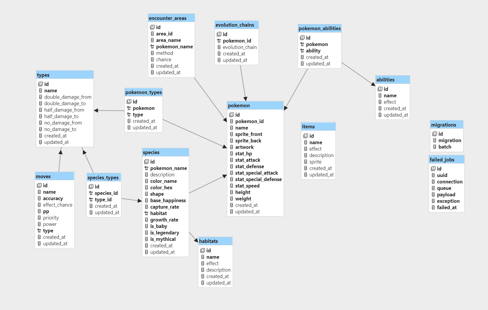

# Deep Dive: Pokémon Data Backend Database & API.

## 🎯 **Purpose:**
The project aims to create an easy-to-use, robust, and well-documented API to give seamless access to Pokémon data. Our primary objectives include not only providing access but ensuring ease of use through comprehensive documentation, efficient data filtering, and caching. By offering a user-centric API, we aim to empower other developers to effortlessly integrate Pokémon data into their applications, without them having to worry about their own caching solutions. Our data comes from PokeAPI; this can be used by anyone however they require you to locally cache resources as you request them. This is understandable but could be tough if you're a pure frontend developer. Pokebits periodically checks the PokeAPI and populates our own database with all the data. We also will do all the caching for you. Meaning you can focus on your front-end project, without having to worry about breaking PokeAPI their fair-use policy.

## 🔍 **Scope:**

**Will:**

-   Provide a user-friendly and accessible API interface for getting Pokémon data.
-   Implement robust filtering mechanisms for efficient and specific data.
-   Develop comprehensive documentation that simplifies API usage and integration.
-   Generate OpenAPI Spec documentation to ensure clarity and ease of adoption.
-   Provide Postman Collections for quick integration and streamlined usage.
-   Explore potential integrations with frontend applications and data dashboards for enhanced user experiences.

**Won't:**

-   Engage in web scraping activities for data gathering; instead, data will be sourced from PokeAPI and stored in our database for serving purposes.
-   Limit data access to English language-only, ensuring uniformity and simplicity.
-   Develop user accounts or authentication systems, focusing solely on providing data access.
-   Build a separate dashboard, as the project solely focuses on backend development.

## 📝 **User Stories and Tasks:**  
Detailed user stories and task breakdowns will be meticulously outlined in subsequent phases, aligning with the project's objectives. You can check our [Trello-board](https://trello.com/b/UXnsh82o/pok%C3%A9bits) to see all the user stories.

## 💻 **Technologies:**

-   **Development:**

    -   **PHP:** Chosen for the backend as we will also use Laravel.
    -   **MySQL:** Optimal for data storage, retrieval, and management within the relational database paradigm.
    -   **Laravel Framework:** Utilizing the Laravel framework for its powerful abstractions, facilitating rapid development and clean, maintainable code. This will allow us to ship the product much faster opposed to plain PHP.
    -   **EloquentORM:** Leveraging EloquentORM for simplified and expressive database interactions.
    -   **Intervention Image:** Integration of Intervention Image for efficient handling and manipulation of Pokémon images. For example, we will use this to get the average Pokemon color as requested by our project owner.

-   **Deployment & Monitoring:**
    -   **Nginx:** Selected for web server deployment.
    -   **Cloudflare:** Utilizing Cloudflare as a content delivery network (CDN) for enhanced performance and security.
    -   **Laravel Telescope:** Implementation of Laravel Telescope for real-time monitoring, allowing insight into requests, responses, and system performance metrics.

##  🗃️ **Database Design:**  
### 📝 **Database Planning for Pokémon API**

**Pokemons Table**

-   `id`: Unique identifier for each Pokémon.
-   `pokemon_id`: Identifier for the Pokémon.
-   `name`: Name of the Pokémon.
-   `sprite_front`: URL/link for the front sprite image.
-   `sprite_back`: URL/link for the back sprite image.
-   `artwork`: URL/link for the artwork image.
-   `stat_speed`, `stat_special_defense`, `stat_special_attack`, `stat_defense`, `stat_attack`, `stat_hp`: Attributes for various statistics.
-   `weight`: Weight of the Pokémon.
-   `height`: Height of the Pokémon.

**Species Table**

-   `id`: Unique identifier for each species.
-   `pokemon_name`: Foreign key referencing Pokémon name.
-   `description`: Description of the Pokémon species.
-   `types`: Array containing Pokémon types (e.g., `['grass', 'poison']`).
-   `color_name`, `color_hex`: Attributes about the color of the Pokemon.
-   `shape`: Shape of the Pokémon.
-   `base_happiness`, `capture_rate`: Values for happiness and capture rate.
-   `habitat`: Foreign key referencing habitat name.
-   `growth_rate`: Rate at which the Pokémon grows.
-   `is_baby`, `is_legendary`, `is_mythical`: Boolean values for specific traits.

**Evolution_Chains Table**

-   `id`: Unique identifier for each evolution chain.
-   `pokemon_id`: Foreign key referencing Pokémon id.
-   `evolution_chain`: Array representing the evolution chain (e.g., `['bulbasaur', 'ivysaur', 'venusaur']`).

**Encounter_Areas Table**

-   `id`: Unique identifier for each encounter area.
-   `area_id`, `area_name`: Identification and name of the area.
-   `pokemon_name`: Foreign key referencing Pokémon name.
-   `method`: Method of encountering the Pokémon.
-   `chance`: Probability/chance of encountering the Pokémon.

**Items Table**

-   `id`: Unique identifier for each item.
-   `name`: Name of the item.
-   `effect`: Effect (description) of the item.
-   `description`: Description of the item.
-   `sprite`: URL/link for the item's sprite.

**Moves Table**

-   `id`: Unique identifier for each move.
-   `name`: Name of the move.
-   `accuracy`, `effect_chance`, `pp`, `priority`, `power`: Attributes related to the move statistics.
-   `type`: Foreign key referencing type name.

**Abilities Table**

-   `id`: Unique identifier for each ability.
-   `name`: Name of the ability.
-   `effect`: Effect description of the ability.

**Habitats Table**

-   `id`: Unique identifier for each habitat.
-   `name`: Name of the habitat.
-   `effect`: Effect of the habitat.
-   `description`: Description of the habitat.

**Types Table**

-   `id`: Unique identifier for each type.
-   `name`: Name of the type.
-   `double_damage_from`, `double_damage_to`, `half_damage_from`, `half_damage_to`, `no_damage_from`, `no_damage_to`: Arrays listing type interactions (e.g., `['flying', 'steel']`).

**Pokemon_Abilities Table (pivot)**

-   `id`: Unique identifier for Pokémon abilities.
-   `pokemon`: Foreign key referencing Pokémon name.
-   `ability`: Foreign key referencing ability name.

**Pokemon_Types Table (pivot)**

-   `id`: Unique identifier for Pokémon types.
-   `pokemon`: Foreign key referencing Pokémon name.
-   `type`: Foreign key referencing type name.

_Please note that slight changes might occur during development._

### 📋 **ERD:**

## 📅 **Planning:**  
- **Day 1:**
  - Finish documentation
  - Make database planning
- **Day 2:**
  - Make user stories
  - Data in database
  - Improve documentation
- **Day 3:**
  - Start with the API
- **Day 4:**
  - Finish API
  - Test API
- **Day 5:**
  - Finishing touches
  - Prepare for presentation

## 🖼️ **Wireframe:**  
As a backend-centric project, wireframing is not applicable in this context, focusing solely on API and database design.

---

_***TLDR**:*
We're creating an easy-to-use Pokémon data API with robust filtering, good documentation, and caching. We'll pull data from PokeAPI, store it ourselves, and handle caching so developers can focus on their front-end. No scraping, only English data, no user accounts or dashboards. Using PHP, Laravel, MySQL, and other tech for development, deployment, and monitoring. Detailed planning and wireframing not relevant for this backend-focused project._
